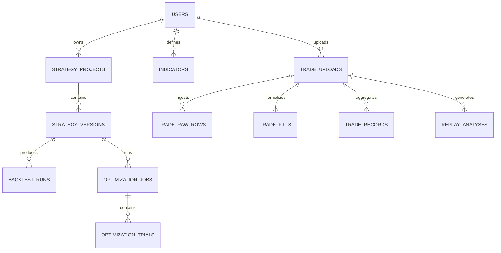

# AI 量化交易平台数据模型设计

## 设计目标

数据模型要同时支撑四条核心链路：

1. 自然语言策略生成与保存
2. 自定义指标管理
3. 策略回测与参数优化
4. 交割单上传、解析与复盘分析

设计原则：

- 演示期优先保证清晰和可迭代，允许部分字段使用 JSONB
- 回测与复盘共用同一套指标和行情口径
- 原始文件和大体量序列尽量不直接塞进数据库
- 支持策略版本化和复盘建议回灌
- 回测结果必须具备可复现性和可追溯性
- 长任务需要能表达队列状态、进度和失败原因

## 存储分层

### 1. PostgreSQL

存放结构化元数据：

- 用户
- 策略项目
- 策略版本
- 指标定义
- 回测结果摘要
- 参数优化结果
- 交割单上传记录
- 标准化交易记录
- 复盘分析结果

### 2. 文件存储

存放原始和大文件：

- 原始交割单文件
- 样例或缓存行情文件
- 大体量净值曲线缓存

### 3. 内存 / 临时计算

运行时生成、不落库：

- LLM 中间提示词
- 临时指标序列
- 回测运行过程中的中间状态

## 核心实体



## 表设计

### 1. users

用户表，演示期保留单用户能力，但建模仍保留用户维度。

| 字段 | 类型 | 必填 | 说明 |
| --- | --- | --- | --- |
| id | uuid | 是 | 主键 |
| name | varchar(100) | 是 | 用户名 |
| email | varchar(255) | 否 | 邮箱 |
| created_at | timestamptz | 是 | 创建时间 |
| updated_at | timestamptz | 是 | 更新时间 |

### 2. strategy_projects

策略项目是策略的逻辑容器，用于归档多个版本。

| 字段 | 类型 | 必填 | 说明 |
| --- | --- | --- | --- |
| id | uuid | 是 | 主键 |
| user_id | uuid | 是 | 关联 users.id |
| title | varchar(200) | 是 | 项目标题 |
| description | text | 否 | 项目说明 |
| created_at | timestamptz | 是 | 创建时间 |
| updated_at | timestamptz | 是 | 更新时间 |

### 3. strategy_versions

每次自然语言生成、手工修改或应用复盘建议后，都产生一个新版本。

| 字段 | 类型 | 必填 | 说明 |
| --- | --- | --- | --- |
| id | uuid | 是 | 主键 |
| project_id | uuid | 是 | 关联 strategy_projects.id |
| natural_language_prompt | text | 是 | 原始自然语言描述 |
| strategy_dsl | jsonb | 是 | 结构化策略定义 |
| explanation | text | 否 | AI 解释摘要 |
| source_type | varchar(30) | 是 | `nl_generated` / `manual_edit` / `replay_promoted` |
| parent_version_id | uuid | 否 | 来源版本 |
| prompt_template_version | varchar(50) | 是 | 策略生成提示词版本 |
| llm_provider | varchar(50) | 否 | 模型提供方 |
| llm_model | varchar(100) | 否 | 模型名 |
| llm_request_id | varchar(100) | 否 | 外部请求 ID |
| dsl_schema_version | varchar(50) | 是 | DSL schema 版本 |
| validation_rule_version | varchar(50) | 是 | 校验规则版本 |
| created_at | timestamptz | 是 | 创建时间 |

### 4. indicators

统一管理内置和自定义指标。

| 字段 | 类型 | 必填 | 说明 |
| --- | --- | --- | --- |
| id | uuid | 是 | 主键 |
| user_id | uuid | 否 | 自定义指标归属用户；内置指标可为空 |
| name | varchar(100) | 是 | 指标名 |
| type | varchar(20) | 是 | `builtin` / `custom` |
| expression | text | 否 | 自定义指标表达式 |
| description | text | 否 | 指标说明 |
| meta | jsonb | 是 | 参数 schema、示例等 |
| created_at | timestamptz | 是 | 创建时间 |

### 5. backtest_runs

每次回测生成一条记录。

| 字段 | 类型 | 必填 | 说明 |
| --- | --- | --- | --- |
| id | uuid | 是 | 主键 |
| strategy_version_id | uuid | 是 | 关联 strategy_versions.id |
| market | varchar(50) | 是 | 标的，如 BTCUSDT |
| timeframe | varchar(20) | 是 | 周期，如 1h |
| date_from | timestamptz | 是 | 回测开始时间 |
| date_to | timestamptz | 是 | 回测结束时间 |
| dataset_snapshot_ref | varchar(120) | 是 | 行情数据快照引用 |
| execution_contract | jsonb | 是 | 手续费、滑点、撮合规则、时区、复权口径等 |
| engine_version | varchar(50) | 是 | 回测引擎版本 |
| metrics | jsonb | 是 | 收益、回撤、胜率等摘要 |
| equity_curve | jsonb | 是 | 净值曲线摘要 |
| trade_points | jsonb | 是 | 买卖点或交易明细摘要 |
| status | varchar(20) | 是 | `queued` / `running` / `completed` / `failed` / `cancelled` |
| progress_pct | integer | 是 | 执行进度 |
| error_code / error_message | varchar / text | 否 | 失败诊断 |
| queued_at / started_at / finished_at | timestamptz | 否 | 生命周期时间 |
| created_at | timestamptz | 是 | 创建时间 |

### 6. optimization_jobs

参数优化任务头表。

| 字段 | 类型 | 必填 | 说明 |
| --- | --- | --- | --- |
| id | uuid | 是 | 主键 |
| strategy_version_id | uuid | 是 | 关联策略版本 |
| objective | varchar(50) | 是 | 优化目标，如 profit_factor |
| search_space | jsonb | 是 | 参数搜索空间 |
| dataset_config | jsonb | 是 | 使用的数据集配置 |
| dataset_snapshot_ref | varchar(120) | 是 | 数据快照引用 |
| execution_contract | jsonb | 是 | 执行契约 |
| engine_version | varchar(50) | 是 | 回测引擎版本 |
| status | varchar(20) | 是 | `queued` / `running` / `completed` / `failed` / `cancelled` |
| progress_pct | integer | 是 | 执行进度 |
| best_params | jsonb | 否 | 最优参数 |
| best_metrics | jsonb | 否 | 最优指标 |
| error_code / error_message | varchar / text | 否 | 失败诊断 |
| queued_at / started_at / finished_at | timestamptz | 否 | 生命周期时间 |
| created_at | timestamptz | 是 | 创建时间 |
| updated_at | timestamptz | 是 | 更新时间 |

### 7. optimization_trials

参数优化每次尝试的明细表。

| 字段 | 类型 | 必填 | 说明 |
| --- | --- | --- | --- |
| id | uuid | 是 | 主键 |
| job_id | uuid | 是 | 关联 optimization_jobs.id |
| params | jsonb | 是 | 本次参数组合 |
| metrics | jsonb | 是 | 本次回测结果 |
| rank_score | numeric | 否 | 排名得分 |
| created_at | timestamptz | 是 | 创建时间 |

### 8. trade_uploads

交割单上传批次记录。

| 字段 | 类型 | 必填 | 说明 |
| --- | --- | --- | --- |
| id | uuid | 是 | 主键 |
| user_id | uuid | 是 | 关联 users.id |
| source_file_name | varchar(255) | 是 | 原文件名 |
| storage_path | text | 是 | 文件存储路径 |
| storage_sha256 | varchar(64) | 否 | 文件哈希 |
| market_type | varchar(50) | 否 | 市场类型 |
| timezone | varchar(50) | 否 | 文件时区 |
| parse_status | varchar(20) | 是 | `uploaded` / `mapping_pending` / `parsed` / `failed` / `purged` |
| detected_columns | jsonb | 是 | 自动识别到的列 |
| column_mapping | jsonb | 否 | 用户确认后的字段映射 |
| pii_status | varchar(20) | 是 | `unknown` / `clean` / `needs_masking` / `masked` |
| parse_version | varchar(50) | 是 | 解析器版本 |
| normalize_version | varchar(50) | 是 | 标准化规则版本 |
| retention_until | timestamptz | 否 | 文件保留期限 |
| purge_status | varchar(20) | 是 | `active` / `scheduled` / `deleted` |
| created_at | timestamptz | 是 | 创建时间 |

### 9. trade_raw_rows

保留原始上传文件的逐行数据，便于重复映射、排查解析错误和做审计。

| 字段 | 类型 | 必填 | 说明 |
| --- | --- | --- | --- |
| id | uuid | 是 | 主键 |
| upload_id | uuid | 是 | 关联 trade_uploads.id |
| row_number | integer | 是 | 原始行号 |
| raw_cells | jsonb | 是 | 原始单元格快照 |
| normalized_cells | jsonb | 是 | 初步标准化后的字段 |
| created_at | timestamptz | 是 | 创建时间 |

### 10. trade_fills

标准化后的成交 fills，一行原始记录可能对应一条或多条 fill。

| 字段 | 类型 | 必填 | 说明 |
| --- | --- | --- | --- |
| id | uuid | 是 | 主键 |
| upload_id | uuid | 是 | 关联 trade_uploads.id |
| symbol | varchar(50) | 是 | 标的 |
| side | varchar(10) | 是 | `long` / `short` |
| fill_time | timestamptz | 是 | 成交时间 |
| quantity | numeric(24,8) | 否 | 数量 |
| fill_price | numeric(24,8) | 否 | 成交价 |
| fees | numeric(24,8) | 否 | 手续费 |
| source_row_ids | jsonb | 是 | 来源原始行 ID |
| created_at | timestamptz | 是 | 创建时间 |

### 11. trade_records

聚合后的完整交易记录，一笔完整交易一条，便于做胜率、盈亏比和复盘分析。

| 字段 | 类型 | 必填 | 说明 |
| --- | --- | --- | --- |
| id | uuid | 是 | 主键 |
| upload_id | uuid | 是 | 关联 trade_uploads.id |
| open_fill_ids | jsonb | 是 | 开仓 fills 集合 |
| close_fill_ids | jsonb | 是 | 平仓 fills 集合 |
| symbol | varchar(50) | 是 | 标的 |
| side | varchar(10) | 是 | `long` / `short` |
| entry_time | timestamptz | 是 | 入场时间 |
| exit_time | timestamptz | 否 | 出场时间 |
| quantity | numeric(24,8) | 否 | 数量 |
| entry_price | numeric(24,8) | 否 | 入场价格 |
| exit_price | numeric(24,8) | 否 | 出场价格 |
| pnl | numeric(24,8) | 否 | 盈亏 |
| fees | numeric(24,8) | 否 | 手续费 |
| holding_seconds | integer | 否 | 持仓秒数 |
| raw_payload | jsonb | 是 | 聚合后的标准化快照 |
| created_at | timestamptz | 是 | 创建时间 |

### 12. replay_analyses

每次复盘分析的结果。

| 字段 | 类型 | 必填 | 说明 |
| --- | --- | --- | --- |
| id | uuid | 是 | 主键 |
| upload_id | uuid | 是 | 关联 trade_uploads.id |
| focus_dimensions | jsonb | 是 | 分析维度 |
| custom_prompt | text | 否 | 用户指定的关注点 |
| feature_snapshot_ref | varchar(120) | 否 | 特征快照引用 |
| analysis_rule_version | varchar(50) | 是 | 复盘规则版本 |
| llm_provider | varchar(50) | 否 | 模型提供方 |
| llm_model | varchar(100) | 否 | 模型名 |
| llm_request_id | varchar(100) | 否 | 外部请求 ID |
| prompt_template_version | varchar(50) | 是 | 复盘提示词版本 |
| status | varchar(20) | 是 | `queued` / `running` / `completed` / `failed` / `cancelled` |
| progress_pct | integer | 是 | 执行进度 |
| summary | text | 否 | AI 复盘摘要 |
| winning_patterns | jsonb | 是 | 盈利交易特征 |
| losing_patterns | jsonb | 是 | 亏损交易特征 |
| suggestion_rules | jsonb | 是 | 建议规则列表 |
| confidence | jsonb | 是 | 置信度信息 |
| error_code / error_message | varchar / text | 否 | 失败诊断 |
| queued_at / started_at / finished_at | timestamptz | 否 | 生命周期时间 |
| created_at | timestamptz | 是 | 创建时间 |

## 策略 DSL 的存储结构

`strategy_versions.strategy_dsl` 建议采用统一结构：

```json
{
  "market": "BTCUSDT",
  "timeframe": "1h",
  "entry": {
    "all": [
      {
        "indicator": "sma_cross",
        "params": { "fast": 5, "slow": 20 },
        "operator": "==",
        "value": true
      }
    ]
  },
  "exit": {
    "any": [
      {
        "indicator": "take_profit_pct",
        "operator": ">=",
        "value": 0.08
      }
    ]
  },
  "position": {
    "side": "long",
    "max_positions": 1
  }
}
```

这样做的好处：

- AI 输出可控
- 回测引擎输入统一
- 复盘建议可直接做 patch

## 复盘结果的存储结构

`replay_analyses` 建议保留结构化字段，避免只存文本：

### winning_patterns

```json
[
  {
    "dimension": "moving_average_structure",
    "pattern": "price_above_ma20",
    "support": 0.72,
    "avg_pnl": 138.5
  }
]
```

### losing_patterns

```json
[
  {
    "dimension": "volume_structure",
    "pattern": "volume_below_ma10",
    "support": 0.66,
    "avg_pnl": -95.2
  }
]
```

### suggestion_rules

```json
[
  {
    "title": "避免缩量弱势入场",
    "reason": "亏损交易更常出现在低于10周期均量时",
    "dsl_patch": {
      "entry_filter": {
        "indicator": "volume_ratio",
        "operator": ">",
        "value": 1.0
      }
    }
  }
]
```

## 可追溯性与版本字段

平台化视角下，数据模型不能只保存“结果”，还要保存“结果是怎么来的”。

### 策略生成链路

- `prompt_template_version`
- `llm_provider`
- `llm_model`
- `llm_request_id`
- `dsl_schema_version`
- `validation_rule_version`

### 回测链路

- `dataset_snapshot_ref`
- `execution_contract`
- `engine_version`
- `status`
- `progress_pct`
- `error_code / error_message`

### 复盘链路

- `feature_snapshot_ref`
- `analysis_rule_version`
- `prompt_template_version`
- `llm_provider`
- `llm_model`
- `llm_request_id`

这些字段的价值在于：

- 同样的输入可以复现同样的结果
- 模型升级后能追踪影响范围
- 回测和复盘出现问题时可以定位是数据、规则还是模型导致

## 文件结构设计

### 交割单文件

文件路径建议：

```text
storage/uploads/{user_id}/{upload_id}/original.xlsx
```

### 行情数据文件

文件路径建议：

```text
storage/market-data/{market}/{timeframe}/{year}.parquet
```

原因：

- 方便按市场和周期分片
- 后续可替换为对象存储，不影响数据库模型

## 索引设计

### 必要索引

- `strategy_versions(project_id, created_at desc)`
- `backtest_runs(strategy_version_id, created_at desc)`
- `optimization_jobs(strategy_version_id, created_at desc)`
- `optimization_trials(job_id)`
- `trade_uploads(user_id, created_at desc)`
- `trade_raw_rows(upload_id, row_number)`
- `trade_fills(upload_id, symbol, fill_time)`
- `trade_records(upload_id, symbol, entry_time)`
- `replay_analyses(upload_id, created_at desc)`

### 目的

- 加快项目详情页加载
- 加快历史回测列表查询
- 加快交割单复盘记录查询
- 加快按上传批次读取交易记录

## 为什么不把所有东西都拆很细

当前是一周内要交付的研究型平台，不是生产级交易系统。

因此：

- 允许回测 metrics 用 JSONB 快速迭代
- 允许复盘结果用 JSONB 保存结构化模式
- 不急着拆“策略条件表”“收益曲线点位表”这种高细粒度模型

这样可以保证：

- 开发快
- 设计清楚
- 后续真要落地，也还能逐步拆分

## 数据模型验收标准

- 能清楚说出有哪些核心表
- 能说明每张表服务哪条业务链路
- 能解释策略、回测、交割单、复盘之间的关系
- 能说明哪些数据落 PostgreSQL，哪些放文件系统
- 能支持“复盘建议转新策略版本”这条闭环
