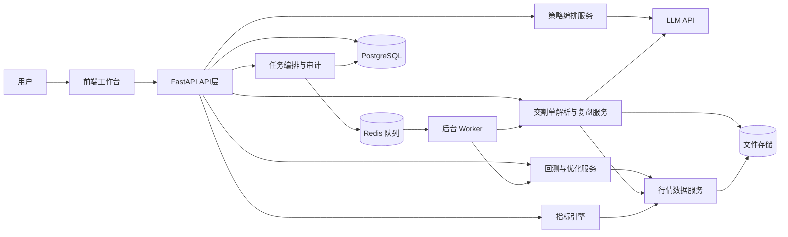
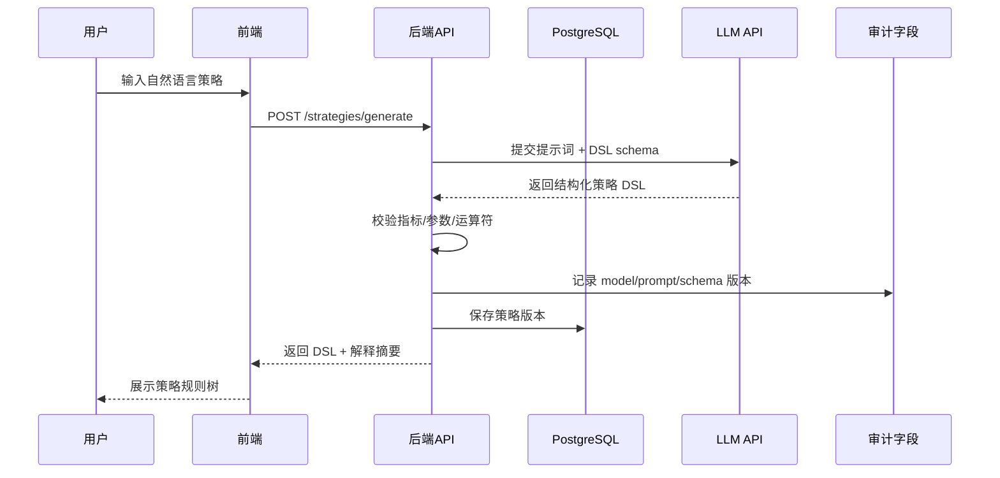
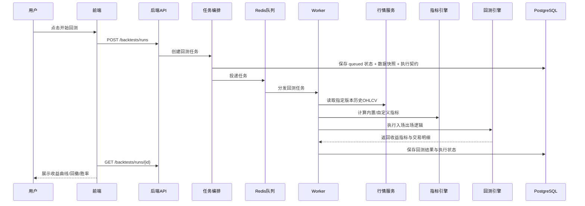
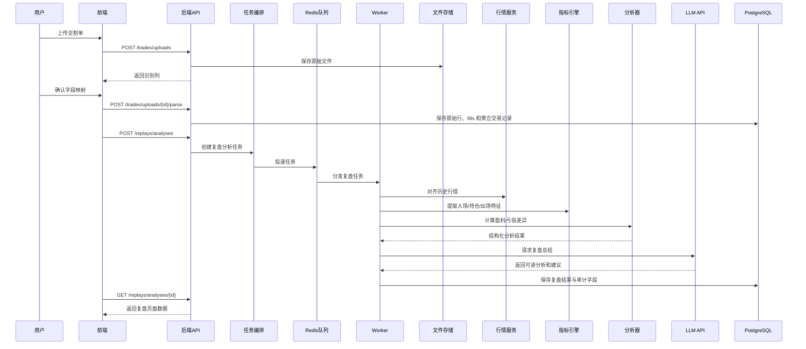
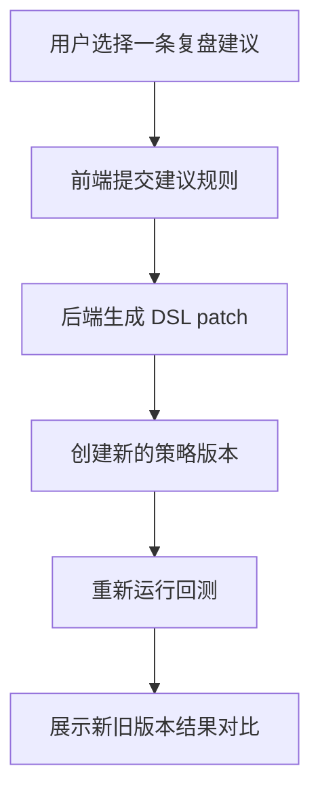
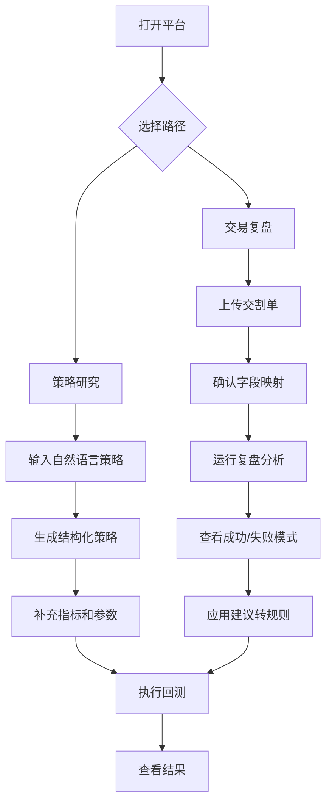
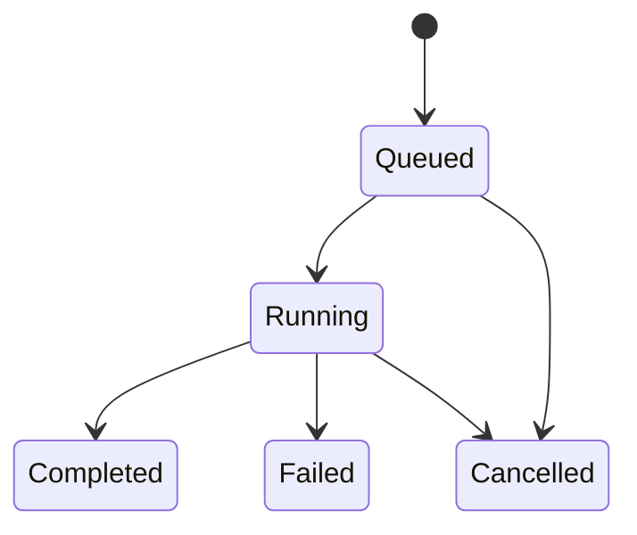
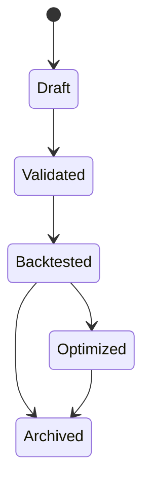
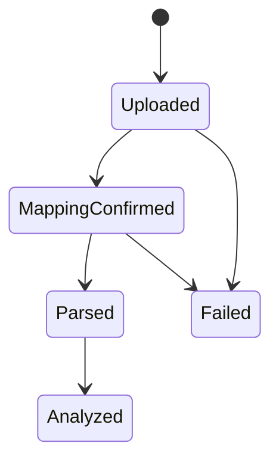

# AI 量化交易平台架构与流程图

## 1. 总体系统架构

## 2. 自然语言生成策略流程

## 3. 回测流程

## 4. 交割单复盘流程

## 5. 复盘建议回灌策略流程

## 6. 业务流程图

## 7. 状态转换图

### 长任务状态

### 策略版本状态

### 交割单上传状态

## 8. 如何在汇报时讲这些图

- 先讲总体系统架构，说明前端、后端、AI、回测、复盘的关系
- 再讲两条主流程：策略研究流程和交割单复盘流程
- 最后讲建议回灌策略，强调它形成了闭环
