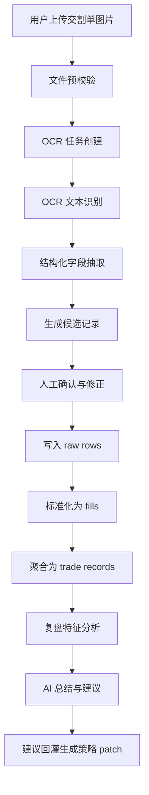

# AI量化交易平台模块 5：OCR 识别链路设计稿

## 1. 目标

在交易复盘与建议回灌模块中，除了支持 `CSV / XLSX` 导入外，再增加 `交割单图片上传 -> OCR 识别 -> 人工确认 -> 标准化入库 -> 复盘分析` 的完整链路，降低非技术用户整理数据的门槛。

该链路的目标不是“图片一上传就自动进入复盘”，而是：

1. 允许用户直接上传截图、拍照图片或券商导出的图片文件
2. 通过 OCR 抽取候选交易字段
3. 在进入分析前由用户确认识别结果
4. 再将确认后的结果标准化为 `raw rows -> fills -> trade records`
5. 最终进入复盘、建议生成和建议回灌闭环

---

## 2. 输入范围

### 支持的输入类型

- `CSV`
- `XLSX`
- `PNG / JPG / JPEG / WEBP / PDF（后续）`

### 图片输入的典型来源

- 券商交割单截图
- 券商 APP 成交记录页面截图
- 拍照后的纸质成交单
- 多张截图拼接后的长图

### 当前优先级

- P0：单张图片 OCR
- P1：多张图片批量 OCR
- P1：长图自动切片识别
- P2：PDF 多页解析

---

## 3. 完整业务链路



---

## 4. 页面与交互设计

### 4.1 交易复盘页新增的交互分区

#### A. 上传入口

- 上传方式切换：
  - `表格文件`
  - `图片 OCR`
- 图片上传区支持：
  - 点击上传
  - 拖拽上传
  - 多图队列（后续）

#### B. OCR 识别结果确认区

- 左侧显示原始图片预览
- 右侧显示 OCR 提取结果表格
- 每一行字段可编辑：
  - 成交时间
  - 标的代码
  - 标的名称
  - 买卖方向
  - 数量
  - 成交价格
  - 手续费
  - 备注/来源页
- 对低置信度字段高亮提示

#### C. 标准化确认区

- 用户确认字段映射和修正结果
- 点击“确认入库”
- 系统将记录转入 `raw rows`

#### D. 复盘分析区

- 展示识别后的标准化交易记录
- 展示盈利 / 亏损特征统计
- 展示 AI 总结与建议规则

---

## 5. API / 任务契约

OCR 相关接口建议全部采用异步任务模型。

### 5.1 上传图片

`POST /api/v1/trade-images/uploads`

请求：

- `multipart/form-data`
  - `files[]`
  - `broker_hint`（可选）
  - `account_name`（可选）

响应：

```json
{
  "success": true,
  "data": {
    "upload_id": "img_upload_xxx",
    "files": [
      {
        "file_id": "img_file_xxx",
        "file_name": "trade_01.png",
        "status": "uploaded"
      }
    ]
  }
}
```

### 5.2 创建 OCR 识别任务

`POST /api/v1/trade-images/uploads/{upload_id}/ocr-jobs`

响应：

```json
{
  "success": true,
  "data": {
    "job_id": "ocr_job_xxx",
    "status": "queued"
  }
}
```

### 5.3 查询 OCR 任务结果

`GET /api/v1/ocr-jobs/{job_id}`

响应关键字段：

- `status`
- `pages`
- `raw_text`
- `candidate_rows`
- `confidence_summary`
- `warnings`

### 5.4 提交人工确认结果

`POST /api/v1/ocr-jobs/{job_id}/confirm`

请求体：

```json
{
  "confirmed_rows": [
    {
      "trade_time": "2026-03-20 10:31:00",
      "symbol": "600519.SH",
      "side": "BUY",
      "quantity": 100,
      "price": 1520.5,
      "fee": 5.2
    }
  ]
}
```

效果：

- 写入 `raw rows`
- 触发标准化任务

### 5.5 查询标准化结果

`GET /api/v1/trade-uploads/{upload_id}/normalized`

返回：

- `raw_rows`
- `fills`
- `trade_records`

---

## 6. 数据对象设计

### 6.1 图片上传对象

`trade_image_uploads`

- id
- user_id
- project_id
- upload_type = `image_ocr`
- source_broker
- status
- created_at

### 6.2 图片文件对象

`trade_image_files`

- id
- upload_id
- file_name
- storage_path
- page_index
- image_width
- image_height
- created_at

### 6.3 OCR 任务对象

`ocr_jobs`

- id
- upload_id
- status
- model_name
- model_version
- prompt_version
- started_at
- finished_at
- error_message

### 6.4 OCR 原始结果对象

`ocr_results`

- id
- job_id
- file_id
- raw_text
- parsed_blocks
- confidence_summary
- warnings

### 6.5 OCR 候选记录对象

`ocr_candidate_rows`

- id
- job_id
- row_index
- candidate_payload
- confidence_score
- needs_review

### 6.6 用户确认记录对象

`ocr_confirmed_rows`

- id
- job_id
- confirmed_payload
- confirmed_by
- confirmed_at

---

## 7. 标准化策略

OCR 识别结果不直接进入复盘，而是必须经过两层转换：

1. `OCR 文本 -> candidate rows`
2. `confirmed rows -> raw rows -> fills -> trade records`

### 原则

- `candidate rows` 只代表机器猜测
- `confirmed rows` 才是用户认可的结构化输入
- `fills` 代表单次成交明细
- `trade records` 代表聚合后的完整交易

---

## 8. 风险与防护

### 8.1 OCR 误识别风险

问题：
- 数字 0/O、1/I、6/8 容易混淆
- 成交方向和数量可能识别错误

防护：
- 低置信度高亮
- 必须人工确认
- 提供原图与结果并排查看

### 8.2 多券商格式差异

问题：
- 不同券商截图布局差异大

防护：
- 增加 `broker_hint`
- 后续沉淀券商模板

### 8.3 多笔成交合并错误

问题：
- OCR 行识别不等于真实成交单元

防护：
- 先写入 raw rows
- 再做 fills 标准化与 trade records 聚合

### 8.4 敏感信息风险

问题：
- 截图中可能含账户号、余额等敏感字段

防护：
- 上传后先做敏感区域遮罩或字段脱敏
- OCR 结果只保留成交分析所需字段

---

## 9. 下一阶段实施清单

### P0

1. 定义 OCR 任务资源模型
2. 定义 `ocr_jobs / ocr_results / ocr_candidate_rows / ocr_confirmed_rows`
3. 在交易复盘页增加图片上传和结果确认区
4. 完成“上传图片 -> OCR 任务 -> 候选结果 -> 人工确认 -> 标准化入库”最小闭环

### P1

1. 增加多图批量识别
2. 增加券商模板适配
3. 增加低置信度字段自动聚焦
4. 增加 OCR 结果修正历史

### P2

1. 支持 PDF
2. 支持长图自动切片
3. 支持半自动字段对齐学习

---

## 10. 需要总代理冻结的决策

1. OCR 结果是否允许自动入库  
当前建议：**不允许**，必须先人工确认

2. OCR 服务是否走外部多模态模型  
当前建议：先留抽象层，后续根据成本和效果选择

3. OCR 标准中间结构是否独立于表格导入链路  
当前建议：前半段独立，后半段统一汇入 `raw rows -> fills -> trade records`

4. 敏感信息是否在上传后立即脱敏  
当前建议：是，避免后续 OCR 或 AI 总结链路暴露无关隐私字段
