# AI量化交易平台模块实施汇总稿

## 1. 汇总目的

本稿基于 7 个模块子代理的细化结果，统一整理出：

- 每个模块的实施目标
- 每个模块由谁负责细化
- 每个模块下一阶段最重要的落地任务
- 跨模块依赖与冲突
- 需要由总代理先冻结的关键决策
- 推荐的实施顺序

本稿的用途不是替代原设计文档，而是作为后续代码实施和分工推进的执行总稿。

---

## 2. 模块总览

| 模块 | 子代理 | 模块定位 | 当前实施重点 |
| --- | --- | --- | --- |
| 模块 1：用户工作台与项目组织 | `Copernicus` | 把分散功能页组织成以项目为中心的研究工作台 | 冻结 `project` 一级组织单位，补项目列表、项目详情、最近活动 |
| 模块 2：策略编排 | `Ampere` | 把自然语言输入转成可信策略资产 | 冻结 `DSL 为真，Python 为展示`，补独立校验、版本链路 |
| 模块 3：指标与规则知识系统 | `Cicero` | 为策略、回测、复盘提供统一知识底座 | 冻结指标与术语版本化、自定义指标安全边界、知识快照 |
| 模块 4：回测执行与结果 | `Mill` | 把策略版本转成可复现、可比较的研究结果 | 冻结执行契约、快照字段、回测详情页、复跑与对比 |
| 模块 5：交易复盘与建议回灌 | `Jason` | 把真实交易记录转成复盘建议并回灌策略 | 冻结 `trade-imports` 聚合根、OCR 链路、标准化模型、建议 patch |
| 模块 6：平台底座与治理 | `Kant` | 统一任务、追溯、配置、治理和安全边界 | 冻结 API 基线、任务模型、幂等、审计、migration |
| 模块 7：数据库与数据资产 | `Atlas` | 收口业务库与云端行情库的双层数据底座 | 冻结业务库/行情库边界、云端共享 K 线库、增量同步 |

---

## 3. 各模块实施摘要

### 模块 1：用户工作台与项目组织

**模块目标**
- 把当前“多功能页”整合成“以项目为一级单位”的研究工作台
- 统一入口、导航、最近活动和项目上下文

**实施重点**
- 冻结 `project` 为一级组织单位
- 扩展当前 `selectedVersionId` 为 `selectedProjectId + selectedVersionId`
- 补 `WorkspaceOverview`、`ProjectDetail`、`RecentActivityItem` 聚合读模型
- 新增：
  - `/projects`
  - `/projects/{project_id}`

**P0 任务**
- 冻结项目与版本语义
- 补项目聚合查询接口
- 补全局项目上下文状态

**主要依赖**
- 模块 2：版本来源与版本列表
- 模块 4：最近回测与按项目筛选
- 模块 5：最近复盘与建议回灌记录
- 模块 7：`strategy_projects` 物理表与索引

---

### 模块 2：策略编排

**模块目标**
- 把自然语言策略输入转成平台可信策略资产
- 形成“生成 -> 校验 -> 保存 -> 版本化 -> 回测消费”的闭环

**实施重点**
- 冻结 `DSL 为真，Python 为展示与教学层`
- 新增独立校验接口 `POST /api/v1/strategies/validate`
- 拆分项目读取与版本读取接口
- 补版本字段：
  - `source_type`
  - `parent_version_id`
  - `prompt_template_version`
  - `dsl_schema_version`
  - `validation_rule_version`
  - `indicator/glossary/rule snapshot version`

**P0 任务**
- 校验逻辑独立化
- 项目与版本读模型拆分
- 策略页状态从轻量版本状态升级为项目+版本+草稿+校验组合状态

**主要依赖**
- 模块 3：指标、术语、规则快照
- 模块 4：只消费已校验版本
- 模块 6：统一追溯字段和资源契约
- 模块 7：`strategy_projects / strategy_versions` 表结构

---

### 模块 3：指标与规则知识系统

**模块目标**
- 形成统一的指标知识、市场规则和术语解释系统
- 让策略生成、回测校验和复盘建议共享同一份知识底座

**实施重点**
- 冻结内置指标定义为“执行引擎绑定的权威定义”
- 冻结自定义指标权威形式为：
  - `expression + parsed_ast + validation_result`
  - Python 仅作为展示层
- 冻结默认规则与执行契约的边界：
  - 模块 3 负责语义/研究规则
  - 模块 4 负责执行规则
- 建立知识快照 `knowledge_snapshot_ref`

**P0 任务**
- 冻结指标/术语/规则/快照的数据对象与版本字段
- 冻结自定义指标安全边界（AST 白名单）
- 冻结市场规则映射关系

**主要依赖**
- 模块 2：生成和校验时绑定知识快照
- 模块 4：回测前知识校验
- 模块 5：建议规则 patch 与指标引用对齐
- 模块 6：快照版本与安全治理

---

### 模块 4：回测执行与结果

**模块目标**
- 把策略版本转成可复现、可追踪、可比较、可复跑的研究结果

**实施重点**
- 冻结回测执行契约：
  - `lot_size`
  - `t_plus_one`
  - `price_limit_rule`
  - `suspension_rule`
  - `adjustment_mode`
- 冻结 `dataset_snapshot_ref + execution_contract + engine_version`
- 回测详情页独立化
- 增加复跑、对比、参数优化结果页

**P0 任务**
- 冻结 `POST /api/v1/backtests/runs` 请求 schema
- 冻结回测详情返回 schema
- 回测详情页独立化
- 历史列表筛选化
- 复跑能力

**主要依赖**
- 模块 2：只消费校验通过版本
- 模块 7：云端共享 K 线库与数据快照
- 模块 6：统一任务系统和错误码
- 模块 5：建议回灌后触发新回测

---

### 模块 5：交易复盘与建议回灌

**模块目标**
- 把交割单和真实成交记录转成可解释、可验证的复盘资产
- 把建议转成策略 patch 并回灌到版本体系

**实施重点**
- 冻结统一导入聚合根：`trade-imports`
- 支持输入：
  - `CSV`
  - `XLSX`
  - `图片 OCR`
- 冻结中间标准：
  - `candidate rows`
  - `confirmed rows`
  - `raw rows -> fills -> trade records`
- 冻结建议落点：`DSL patch`

**P0 任务**
- 图片上传 + OCR 异步任务最小闭环
- OCR 结果人工确认界面
- 标准化任务
- 复盘分析输入改为 `trade_records`
- 建议结构化输出

**主要依赖**
- 模块 4：回测结果对照、回灌后验证回测
- 模块 7：导入、OCR、标准化、建议的数据表结构
- 模块 6：文件治理、任务系统、PII 脱敏
- 模块 2：建议回灌生成新策略版本

---

### 模块 6：平台底座与治理

**模块目标**
- 提供统一 API 契约、任务系统、配置体系、追溯清单和治理边界

**实施重点**
- 统一：
  - API envelope
  - 错误码
  - 请求 ID
  - 幂等键
  - 任务状态机
- 引入：
  - `/api/v1/tasks/{task_id}`
  - `task_record`
  - `trace_manifest`
  - `config_revision`
  - `audit_event`
  - `file_asset`
- 迁移数据库演进方式到 `Alembic`

**P0 任务**
- 平台公共契约文档 + JSON Schema
- 创建型接口补 `request_id` 和 `Idempotency-Key`
- 增加统一任务资源
- 把追溯字段正式落库
- 引入 Alembic

**主要依赖**
- 模块 1：项目上下文与最近活动聚合
- 模块 2/3/4/5：统一使用底座的任务、追溯和治理规则
- 模块 7：逻辑契约冻结后由数据库模块落地

---

### 模块 7：数据库与数据资产

**模块目标**
- 建立业务数据库与云端 K 线行情库的双层数据底座
- 保证所有用户共享统一行情资产

**实施重点**
- 冻结双层架构：
  - `业务库`
  - `云端行情库`
- K 线数据统一进云端共享行情库
- 冻结策略：
  - 首次全量入库
  - 后续仅增量同步
- 冻结回测 / 复盘只能读共享行情库，不直接读公网接口

**P0 任务**
- 冻结双库边界
- 建行情库最小结构
- 实现首次全量入库
- 实现增量同步任务
- 提供共享读取接口

**主要依赖**
- 模块 4：快照、覆盖率、回测读取
- 模块 5：复盘所需行情窗口
- 模块 6：任务调度、迁移机制、命名规范

---

## 4. 跨模块依赖图

```mermaid
flowchart LR
    M6[模块6 平台底座与治理] --> M7[模块7 数据库与数据资产]
    M6 --> M2[模块2 策略编排]
    M6 --> M3[模块3 指标与规则]
    M6 --> M4[模块4 回测执行]
    M6 --> M5[模块5 交易复盘]
    M7 --> M4
    M7 --> M5
    M3 --> M2
    M3 --> M4
    M3 --> M5
    M2 --> M4
    M2 --> M5
    M4 --> M5
    M1[模块1 用户工作台] --> M2
    M1 --> M4
    M1 --> M5
```

---

## 5. 需要先冻结的关键决策

### 5.1 平台级冻结项

1. 一级组织单位冻结为 `project`
2. `DSL 为真，Python 为展示与教学层`
3. 所有创建型 POST 支持 `Idempotency-Key`
4. 所有核心结果资源都必须带 `project_id`
5. v1 API 只允许向后兼容新增字段
6. migration 机制冻结为 `Alembic`

### 5.2 数据与执行冻结项

7. 中国股票 / ETF 是当前唯一正式市场范围
8. 当前最小正式支持粒度为 `日线`
9. K 线数据统一存储于云端共享行情库
10. 历史数据首次全量入库，后续只做增量同步
11. 回测与复盘执行层禁止直接依赖公网行情接口
12. 每次回测、复盘、优化结果必须绑定数据快照

### 5.3 复盘与知识冻结项

13. 复盘统一导入聚合根为 `trade-imports`
14. OCR 结果必须人工确认后才能入库
15. `raw rows -> fills -> trade records` 是唯一标准链路
16. 建议回灌统一落为 `DSL patch`
17. 自定义指标权威表达为 `expression + AST`
18. 知识系统必须绑定 `knowledge_snapshot_ref`

---

## 6. 推荐实施顺序

### 阶段 1：先冻结底座与数据边界

先做：
- 模块 6 平台底座与治理
- 模块 7 数据库与数据资产

交付物：
- 平台公共契约
- 统一任务模型
- 双库边界
- K 线共享库方案
- Alembic 迁移机制

### 阶段 2：冻结策略与知识真源

再做：
- 模块 2 策略编排
- 模块 3 指标与规则知识系统

交付物：
- DSL / 校验 / 版本链
- 指标 AST 与知识快照
- 术语与规则边界

### 阶段 3：打通研究与复盘执行链

再做：
- 模块 4 回测执行与结果
- 模块 5 交易复盘与建议回灌

交付物：
- 可复现回测详情页
- OCR 导入与标准化
- 建议回灌策略版本
- 回灌后验证回测

### 阶段 4：统一工作台体验

最后做：
- 模块 1 用户工作台与项目组织

交付物：
- 工作台总览
- 项目列表
- 项目详情
- 最近活动流

---

## 7. 实施分工建议

| 阶段 | 负责人 | 主要交付 |
| --- | --- | --- |
| 阶段 1A | `Kant` | 平台公共契约、统一任务模型、追溯字段、错误码、Alembic 基线 |
| 阶段 1B | `Atlas` | 双库边界、行情库 schema、增量同步设计、快照命名规范 |
| 阶段 2A | `Ampere` | 策略生成/校验/版本链路、策略页状态模型 |
| 阶段 2B | `Cicero` | 指标与规则对象模型、知识快照、自定义指标安全边界 |
| 阶段 3A | `Mill` | 回测详情页、执行契约、复跑与对比、结果快照 |
| 阶段 3B | `Jason` | OCR 导入、标准化、复盘分析、建议回灌 |
| 阶段 4 | `Copernicus` | 工作台与项目组织整合 |
| 最终收口 | `总代理` | 冲突协调、整体优化、优先级调整、最终验收 |

---

## 8. 当前建议的下一步

如果马上进入代码实施，建议先做下面 4 件事：

1. 输出 `平台公共契约冻结稿`
2. 输出 `数据库双层边界冻结稿`
3. 输出 `策略版本与知识快照冻结稿`
4. 输出 `trade-imports + OCR + 标准化链路冻结稿`

这 4 份冻结稿完成后，再进入代码实施，返工会少很多。
