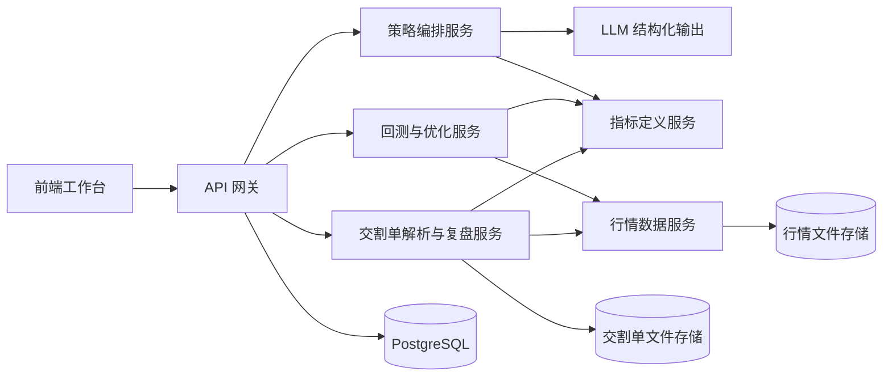

# AI 量化交易平台设计文档

## 项目概述

- 项目名称：AI 量化交易研究与复盘平台
- 一句话定义：面向个人交易者的 AI 策略研究工作台，让用户用自然语言生成量化策略、运行回测、优化参数，并基于历史交割单自动复盘优化交易模式。
- 目标用户：
  - 有交易经验但不会编程的个人交易者
  - 需要快速试错的策略研究员
  - 有大量历史交割单、希望系统提升交易纪律和胜率的用户
- 核心问题：
  - 策略研究门槛高
  - 复盘依赖主观经验
  - 交易优化缺少数据驱动闭环
- 核心价值：
  - 把“自然语言想法”变成“可回测策略”
  - 把“历史交割单”变成“可解释、可迭代的优化建议”

## 用户与场景

### 主用户画像

- 用户角色：股票、期货或数字资产的主动交易者
- 使用频率：研究高频、复盘中频
- 关键诉求：
  - 快速验证策略灵感
  - 找到高胜率交易的共同条件
  - 降低策略表达和复盘分析的技术门槛

### 核心场景

1. 用户用自然语言描述一套基于均线、量价和 RSI 的交易规则，平台自动生成结构化策略并回测。
2. 用户上传过去 6 个月交割单，平台自动分析失败与成功交易的条件差异，并建议减少亏损交易的过滤条件。
3. 用户指定“重点看量价关系和均线结构”，平台基于用户指定维度做定向复盘分析。

### 用户故事

1. 作为 `不会写量化代码的交易者`，我希望 `通过自然语言生成策略并立即回测`，以便 `快速验证自己的交易想法是否可行`。
2. 作为 `已经有历史交割单的交易者`，我希望 `自动分析哪些交易条件更容易导致亏损或盈利`，以便 `修正交易模式并提升后续胜率`。
3. 作为 `有研究能力的用户`，我希望 `创建自定义指标并与内置指标组合使用`，以便 `把自己的交易经验沉淀为结构化规则`。

## 功能优先级

| 功能 | 说明 | 优先级 | 演示是否必需 |
| --- | --- | --- | --- |
| 自然语言生成策略 | 将用户输入转为结构化策略 DSL | Must | 是 |
| 内置指标库 | 支持 MA、EMA、MACD、RSI、ATR、布林带、成交量类指标 | Must | 是 |
| 自定义指标 | 通过受限函数表达式创建自定义指标 | Must | 是 |
| 回测执行 | 基于历史 K 线执行买卖规则并输出结果 | Must | 是 |
| 结果展示 | 展示收益曲线、回撤、胜率、盈亏比、交易明细 | Must | 是 |
| 交割单上传解析 | 上传 CSV/XLSX 并提取成交记录 | Must | 是 |
| AI 复盘分析 | 分析成功/失败原因并输出优化建议 | Must | 是 |
| 参数优化 | 对指定参数做网格搜索 | Should | 否 |
| 复盘建议转策略过滤条件 | 把建议一键转成新的策略规则 | Should | 否 |
| 策略版本对比 | 比较不同版本的回测表现 | Could | 否 |

## 范围边界

### 本期纳入

- 研究型策略生成
- 历史回测
- 参数优化
- 交割单复盘
- 规则优化建议

### 本期不纳入

- 实盘交易执行
- 券商 / 交易所 API 接入
- 实时行情订阅
- 多租户权限体系
- 生产级资金风控

这样收敛后，一周内可以形成完整演示闭环，同时避免掉入高复杂度、强合规的实盘系统开发。

## 技术选型

| 维度 | 选型 | 选择理由 | 备选方案 |
| --- | --- | --- | --- |
| 前端 | Next.js + React + TypeScript + ECharts | 适合数据工作台和图表展示，便于构建多工作区 UI | Vue + Vite |
| 后端 | Python + FastAPI | 便于接入指标计算、回测、数据分析和 LLM 编排 | Node.js + Python 微服务 |
| 数据存储 | PostgreSQL + 本地文件存储 / 对象存储 | PostgreSQL 管理元数据，文件存储保留交割单和行情快照 | SQLite（Demo） |
| 指标与回测 | pandas / polars + pandas-ta + 自研规则执行器 | 一周内更容易落地，且便于自定义指标扩展 | vectorbt / backtrader |
| AI 组件 | 通用 LLM API + 结构化输出 | 用于自然语言转 DSL 和复盘解释，输出受控 | 直接生成 Python 策略代码 |
| 部署方式 | Docker Compose 单机部署 | 适合演示环境，能打包前后端与数据库 | Vercel + Railway 分拆部署 |

## 核心设计原则

1. AI 只生成结构化策略，不直接生成可执行代码。
2. 自定义指标必须走受限表达式，不允许执行任意 Python。
3. 回测和复盘共用同一套指标计算层，避免结果口径不一致。
4. 复盘建议必须建立在可计算特征基础上，再由 AI 做解释和归纳。
5. 整个平台定位于“研究与复盘”，而不是“自动交易执行”。

## 策略 DSL 设计

自然语言最终落地为结构化 DSL，示例：

```json
{
  "market": "BTCUSDT",
  "timeframe": "1h",
  "entry": {
    "all": [
      { "indicator": "sma_cross", "params": { "fast": 5, "slow": 20 }, "operator": "==", "value": true },
      { "indicator": "rsi", "params": { "period": 14 }, "operator": "<", "value": 70 },
      { "indicator": "volume_ratio", "params": { "period": 10 }, "operator": ">", "value": 1.2 }
    ]
  },
  "exit": {
    "any": [
      { "indicator": "take_profit_pct", "operator": ">=", "value": 0.08 },
      { "indicator": "stop_loss_pct", "operator": "<=", "value": -0.03 },
      { "indicator": "sma_cross_down", "params": { "fast": 5, "slow": 20 }, "operator": "==", "value": true }
    ]
  },
  "position": {
    "side": "long",
    "max_positions": 1
  }
}
```

这样做的目的是把 AI 输出控制在平台可验证的语法范围内，并为回测和优化提供统一输入。

## 数据流转

### A. 策略生成与回测链路

1. 用户输入自然语言策略描述。
2. 后端调用 LLM，将输入转换为结构化策略 DSL。
3. DSL 校验器检查指标是否合法、参数是否可解析、运算符是否在白名单内。
4. 策略解释器拉取所需历史 OHLCV 数据。
5. 指标引擎计算内置指标和用户自定义指标。
6. 回测引擎按时间序列执行入场、出场、仓位和收益逻辑。
7. 结果写入回测结果表，并返回指标、收益曲线、交易明细和风险指标。

### B. 参数优化链路

1. 用户选择策略中的可调参数及范围。
2. 后端生成参数组合任务。
3. 优化执行器批量运行回测。
4. 聚合结果，输出最优参数组合、参数敏感性热图和候选区间。

### C. 交割单复盘链路

1. 用户上传交割单 CSV/XLSX。
2. 文件解析器映射字段并标准化为统一成交记录。
3. 交易聚合器将成交记录合并为完整交易生命周期。
4. 市场数据对齐模块根据成交时间匹配历史行情。
5. 指标引擎在每笔交易的入场、持仓、出场时点计算特征。
6. 复盘分析器比较盈利与亏损交易在指标、量价、均线结构上的差异。
7. AI 总结器基于结构化特征生成可读分析和优化建议。
8. 用户可将建议转成策略过滤条件，重新回测验证。

## 业务流转

### 路径 1：自然语言策略研究

1. 打开“策略实验室”
2. 输入自然语言策略想法
3. 查看 AI 生成的策略草案和解释
4. 选择内置指标或添加自定义指标
5. 运行回测
6. 查看收益、胜率、回撤、交易点位
7. 运行参数优化
8. 保存策略版本

### 路径 2：交割单复盘

1. 打开“交易复盘”
2. 上传交割单
3. 查看解析出的交易列表
4. 选择分析视角：默认 / 指标组合 / 指定量价均线维度
5. 查看成功交易与失败交易的对比分析
6. 查看“应避免的场景”和“可加强的入场过滤”
7. 一键生成优化规则并回到策略实验室重新验证

## 系统模块划分



| 模块 | 职责 | 输入 | 输出 | 依赖 |
| --- | --- | --- | --- | --- |
| 前端工作台 | 策略编写、图表展示、复盘交互 | 用户输入、API 响应 | 页面状态、图表、表格 | API 层 |
| API 层 | 路由请求、参数校验、鉴权预留 | HTTP 请求 | JSON 响应 | 各后端服务 |
| 策略编排服务 | NL 转 DSL、策略保存、规则解释 | 自然语言、策略草稿 | 结构化策略、解释文本 | LLM、策略校验器 |
| 指标定义服务 | 管理内置和自定义指标 | 指标表达式、OHLCV | 指标序列 | 指标函数库 |
| 回测与优化服务 | 执行回测、优化参数 | 策略 DSL、参数范围 | 回测结果、优化结果 | 行情数据、指标服务 |
| 交割单解析与复盘服务 | 解析上传文件、提取特征、生成复盘结论 | CSV/XLSX、分析维度 | 结构化复盘结果、优化建议 | 行情数据、指标服务、LLM |
| 行情数据服务 | 统一读取历史行情 | 标的、周期、时间范围 | OHLCV 数据 | 行情文件存储 |

## 数据模型

### 实体列表

- users
- strategy_projects
- strategy_versions
- indicators
- backtest_runs
- optimization_jobs
- optimization_trials
- trade_uploads
- trade_records
- replay_analyses

### 字段设计

| 实体 | 字段 | 类型 | 是否必填 | 说明 |
| --- | --- | --- | --- | --- |
| users | id | uuid | 是 | 用户 ID |
| users | name | varchar | 是 | 用户名 |
| strategy_projects | id | uuid | 是 | 策略项目 ID |
| strategy_projects | user_id | uuid | 是 | 所属用户 |
| strategy_projects | title | varchar | 是 | 项目名 |
| strategy_versions | id | uuid | 是 | 版本 ID |
| strategy_versions | project_id | uuid | 是 | 关联项目 |
| strategy_versions | natural_language_prompt | text | 是 | 原始策略描述 |
| strategy_versions | strategy_dsl | jsonb | 是 | 结构化策略 |
| indicators | id | uuid | 是 | 指标 ID |
| indicators | name | varchar | 是 | 指标名 |
| indicators | type | varchar | 是 | builtin / custom |
| indicators | expression | text | 否 | 自定义表达式 |
| backtest_runs | id | uuid | 是 | 回测 ID |
| backtest_runs | strategy_version_id | uuid | 是 | 关联策略版本 |
| backtest_runs | metrics | jsonb | 是 | 收益指标 |
| backtest_runs | equity_curve | jsonb | 是 | 净值曲线 |
| optimization_jobs | id | uuid | 是 | 优化任务 ID |
| optimization_jobs | strategy_version_id | uuid | 是 | 目标策略 |
| optimization_jobs | parameter_space | jsonb | 是 | 参数范围 |
| optimization_trials | id | uuid | 是 | 单次优化尝试 |
| optimization_trials | job_id | uuid | 是 | 关联优化任务 |
| optimization_trials | params | jsonb | 是 | 参数组合 |
| optimization_trials | metrics | jsonb | 是 | 指标结果 |
| trade_uploads | id | uuid | 是 | 上传批次 |
| trade_uploads | user_id | uuid | 是 | 所属用户 |
| trade_uploads | source_file_name | varchar | 是 | 文件名 |
| trade_records | id | uuid | 是 | 标准化交易记录 |
| trade_records | upload_id | uuid | 是 | 关联上传 |
| trade_records | symbol | varchar | 是 | 标的 |
| trade_records | entry_time | timestamptz | 是 | 入场时间 |
| trade_records | exit_time | timestamptz | 是 | 出场时间 |
| trade_records | pnl | numeric | 是 | 单笔盈亏 |
| replay_analyses | id | uuid | 是 | 复盘分析 ID |
| replay_analyses | upload_id | uuid | 是 | 关联上传 |
| replay_analyses | focus_dimensions | jsonb | 否 | 用户指定维度 |
| replay_analyses | insight_summary | text | 是 | 复盘摘要 |
| replay_analyses | suggestion_rules | jsonb | 是 | 建议规则 |

### 关系说明

- 一个 user 拥有多个 strategy_projects
- 一个 strategy_project 拥有多个 strategy_versions
- 一个 strategy_version 可以对应多个 backtest_runs 和 optimization_jobs
- 一个 trade_uploads 产生多条 trade_records 和多次 replay_analyses
- 必要索引：
  - `strategy_versions(project_id, created_at)`
  - `backtest_runs(strategy_version_id, created_at)`
  - `trade_records(upload_id, symbol, entry_time)`
  - `optimization_trials(job_id)`

## 自定义指标机制

### 设计目标

- 支持用户定义属于自己的指标
- 允许用户把指标用于策略和复盘
- 保证执行安全，不允许任意代码执行

### 实现方式

- 平台提供函数白名单：`SMA`, `EMA`, `MAX`, `MIN`, `STD`, `RSI`, `ATR`, `VOL_MA`, `REF`
- 用户通过表达式定义指标，例如：
  - `EMA(close, 12) - EMA(close, 26)`
  - `(close - SMA(close, 20)) / SMA(close, 20)`
  - `volume / SMA(volume, 10)`
- 后端解析表达式 AST，只允许列名、常量、白名单函数和安全运算符
- 解析后的表达式编译为指标计算图，供回测和复盘复用

### 不采用的方案

- 不允许用户直接上传 Python 脚本
- 不允许直接在数据库中保存可执行代码

## 复盘分析逻辑

复盘不是只让 LLM “读交割单”，而是三层结构：

1. 结构化事实层
   - 每笔交易的标的、方向、时间、盈亏、持仓时间
   - 入场时价格位置、量能状态、均线关系、波动率状态
2. 特征比较层
   - 盈利交易 vs 亏损交易的均值、中位数、分布差异
   - 用户指定维度下的分组统计，例如“放量突破且站上 20 日均线”的胜率
3. AI 解释层
   - 把结构化比较结果转为人类可读的总结
   - 给出“建议增加哪些过滤条件”与“建议避免哪些场景”

这样可以显著降低 AI 幻觉风险，也能让复盘结论可追溯。

## 核心 API 草案

| 方法 | 路径 | 说明 |
| --- | --- | --- |
| `POST` | `/api/strategies/generate` | 自然语言生成策略 DSL |
| `POST` | `/api/indicators/custom` | 创建自定义指标 |
| `POST` | `/api/backtests/run` | 执行单次回测 |
| `POST` | `/api/backtests/optimize` | 执行参数优化 |
| `POST` | `/api/trades/uploads` | 上传交割单 |
| `GET` | `/api/trades/uploads/{id}/records` | 查看解析后的交易记录 |
| `POST` | `/api/replays/analyze` | 运行复盘分析 |
| `POST` | `/api/replays/{id}/promote-rule` | 将复盘建议转为策略规则 |

## 页面草图

### 页面 1：首页 / 工作台

- 目标：让用户快速进入“策略研究”或“交易复盘”
- 主要区域：
  - 最近项目
  - 新建策略按钮
  - 上传交割单入口
  - 最近回测与最近复盘摘要
- 关键交互：
  - 一键进入策略实验室
  - 一键进入复盘工作台

### 页面 2：策略实验室

- 目标：自然语言生成策略并运行回测
- 主要区域：
  - 自然语言输入区
  - 策略 DSL 展示与编辑区
  - 指标选择 / 自定义指标面板
  - 参数面板
  - 回测按钮
- 关键交互：
  - 生成策略
  - 编辑规则
  - 保存版本
  - 发起回测与参数优化

### 页面 3：回测结果页

- 目标：解释策略效果
- 主要区域：
  - 核心指标卡片
  - 收益曲线
  - 回撤曲线
  - 交易明细
  - 参数优化热图
- 关键交互：
  - 切换版本对比
  - 查看单笔交易
  - 从复盘建议生成新版本

### 页面 4：交易复盘页

- 目标：分析历史交割单
- 主要区域：
  - 文件上传区
  - 交易记录解析表
  - 维度筛选面板
  - 成功/失败原因总结
  - 可转策略建议列表
- 关键交互：
  - 上传文件
  - 选择分析维度
  - 查看对比特征
  - 一键转策略规则

## 风险与应对

| 风险类型 | 风险描述 | 影响 | 应对策略 |
| --- | --- | --- | --- |
| 时间 | 同时做策略生成、回测、复盘容易超范围 | 核心闭环做不完 | P0 聚焦自然语言策略、回测、交割单复盘三条最短链路；参数优化延后为 Should |
| 技术 | 自定义指标执行存在安全和复杂度风险 | 可能导致任意代码执行或逻辑失控 | 只支持受限表达式和白名单函数，不执行任意代码 |
| 数据 | 行情数据与交割单时间戳对不齐 | 复盘结果不可信 | 对上传文件做字段映射和时区标准化，无法对齐的数据标记为低置信度 |
| AI | LLM 生成策略和复盘结论有幻觉 | 错误规则进入回测或误导用户 | 使用结构化输出 + 规则校验 + 基于结构化特征的分析提示 |
| 部署 | 回测计算耗时较长，影响演示体验 | 演示时卡顿 | 使用限制数据集和异步任务队列预留，演示时先跑中小规模数据 |
| 合规 | 用户可能误解为投资建议平台 | 合规和风险提示不足 | 明确标注为研究与复盘工具，不提供投资建议，不做实盘下单 |

## 验收标准

- 核心路径通过标准：
  - 输入自然语言后能得到结构化策略
  - 策略能完成回测并返回收益、胜率、回撤等结果
  - 上传交割单后能生成成功/失败特征分析
  - 复盘建议能转化为至少一条新规则并重新回测
- 边界情况验证方式：
  - 非法指标表达式会被拒绝并给出错误提示
  - 上传格式错误的交割单会提示字段缺失
  - 自然语言中含糊描述会触发补充确认或默认解释提示
- 最终演示成功标准：
  - 完整跑通“生成策略 → 回测 → 上传交割单 → 生成复盘建议 → 应用建议重测”闭环

## 开发计划

### 周一

- 任务：
  - 锁定产品范围
  - 明确策略 DSL 和数据模型
  - 定义核心 API
- 输出：
  - 设计文档
  - 演示脚本
  - 页面草图

### 周二

- 任务：
  - 搭建前后端骨架
  - 完成自然语言生成策略接口
  - 完成内置指标与自定义指标表达式解析
- 输出：
  - 第一版策略实验室
  - DSL 校验器

### 周三

- 任务：
  - 完成回测执行与结果展示
  - 完成核心图表与交易明细页面
- 输出：
  - 第一版回测闭环

### 周四

- 任务：
  - 完成交割单上传解析
  - 完成复盘分析管线
  - 接通“复盘建议转规则”
- 输出：
  - 第一版复盘闭环

### 周五

- 任务：
  - 补参数优化
  - 修复联调问题
  - 准备演示与复盘材料
- 输出：
  - 可演示版本
  - 演示脚本
  - 总结报告

## AI 协作记录

| 环节 | 如何使用 AI | AI 输出是否采纳 | 人工验证方式 |
| --- | --- | --- | --- |
| 需求梳理 | 让 AI 帮助拆解策略生成、回测、复盘三个核心能力 | 部分采纳 | 通过范围控制和一周可交付性筛选 |
| DSL 设计 | 让 AI 提供策略 JSON 结构候选 | 采纳后改造 | 人工补齐字段、限制执行边界 |
| 指标设计 | 让 AI 提供内置指标清单和自定义表达式思路 | 采纳 | 人工加入白名单和安全限制 |
| 复盘方法 | 让 AI 给出交割单分析维度和成功/失败归因框架 | 采纳后重写 | 改成“结构化事实 + 统计比较 + AI 总结”三层方案 |
| 风险识别 | 让 AI 列出时间、幻觉、合规和数据对齐风险 | 采纳 | 人工加入不做实盘、非投资建议边界 |
